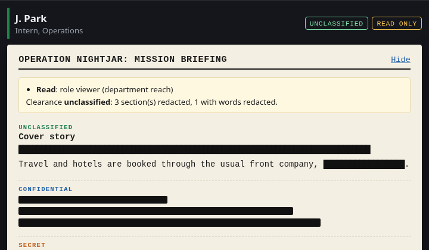
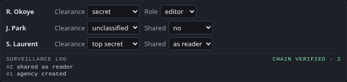
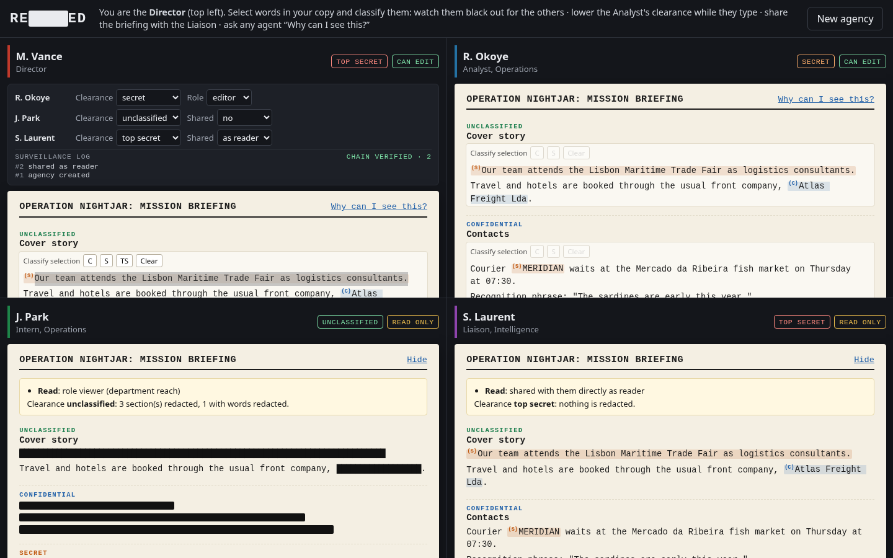
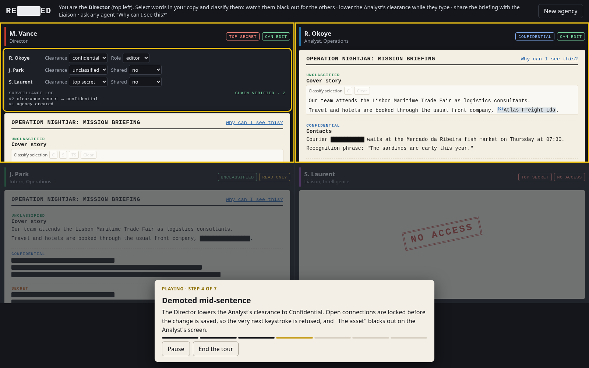

# RBAC API

[](https://github.com/MrtnOmwenga/RBAC-API/actions/workflows/ci.yml)
[](https://github.com/MrtnOmwenga/RBAC-API/actions/workflows/codeql.yml)
[](LICENSE)

A multi-tenant API where the access rules are the product: organizations → departments →
projects → documents, five roles with department scoping, Google Docs-style sharing, clearance
levels on document sections, and API keys for integrations that can never act as people.
Authorization is written once, as data, and enforced three times: in the REST API, on every live
collaboration connection, and by PostgreSQL row-level security underneath both.

NestJS 11 · TypeScript · PostgreSQL 16 (row-level security) · Kysely · Yjs + Hocuspocus
(WebSockets) · zod · Argon2id · pino · Jest + Testcontainers · Playwright · fast-check · Stryker ·
k6 · Docker (distroless) · React + TipTap (demo UI)

## Redacted: the live demo


The demo is a briefing room for secret agents, and it exists to make the backend visible: the UI
is deliberately small, and the product here is the permission model underneath it. Four agents
open the same mission briefing, each in their own frame with their own token, editor state and
WebSocket, as if on four laptops. The Director changes their access live.

| On screen | What the backend is doing |
|---|---|
| Black bars instead of text | Sections above your clearance are never sent: not by the REST API, not over the WebSocket. A browser test records everything the Intern's page receives and checks the hidden text isn't in it. |
| A bar in the middle of a sentence | Words classified above your clearance: you read a copy the server writes at your level, with those words replaced. The full text only goes to people cleared for every word in it. |
| The Director selects words and classifies them: they black out for the others | The update is checked *before* it's applied: anyone connected who isn't cleared is moved to their projection first. Nobody can classify above their own clearance. |
| Clearance lowered while the Analyst types: the section blacks out | A pg `NOTIFY` on commit; the collaboration server re-checks every open connection in the organization and drops the one that lost access. |
| Made a viewer mid-sentence: the editor locks | Same re-check: the connection turns read-only, and anything typed afterwards is discarded by the server, not just hidden by the UI. |
| Shared with the Liaison: the NO ACCESS stamp lifts | A share (person or department, reader or editor, optionally temporary) reaches across departments but never across organizations. |
| "Why can I see this?" | An endpoint that lists every reason for access (role, shares) and what clearance hides. |
| Surveillance log, "chain verified" | The hash-chained audit log, with its verification endpoint. |

| The Intern: bars mid-sentence, and why | The Director's desk: every control is an API call |
|---|---|
|  |  |



**Try it** (Docker, below; then open http://localhost:3000). Each visitor gets a private,
throwaway agency, deleted after two hours. There are three ways in:

- **Play it for me:** a two-minute demo that runs itself, narrated step by step. The Analyst types,
  the Director lowers their clearance mid-sentence, classifies a phrase and shares the briefing.
  Nothing is animated: every step is a real API call or a real edit in that agent's editor, and the
  other panes react because the server tells them to.
- **Guide me:** the same story, done by you. Each step lights up the panes involved and moves on
  when the server (or the agent's screen) shows the change happened.
- **Enter the briefing room** and explore freely:



1. In the Director's copy (top left), select a sentence in *Cover story* and click **S**: it turns
   into a bar in the Intern's copy.
2. Click into the Analyst's *Contacts* section and type; meanwhile, set their clearance to
   *unclassified* on the Director's desk. The section blacks out under their cursor.
3. Set the Analyst's role to *viewer*: their editor locks.
4. Share the briefing with the Liaison: the NO ACCESS stamp lifts.
5. Click **Why can I see this?** in any pane, and watch the surveillance log fill up.

## Highlights

- **Policy as data.** One table (`src/policy/policy.ts`) says which role may do what, and how far:
  anywhere in the organization, in their own department, or only on what they created. Every
  endpoint asks the same `can(principal, action, resource)`. The permission table below is
  generated from it, and CI fails if the two differ.
- **Tenant isolation the database enforces.** The API connects as a role that owns nothing. Every
  tenant table has forced row-level security keyed on a transaction-local `app.org_id`, so a query
  that forgets its `where org_id = …` still can't see or write another organization's rows.
  Composite foreign keys make cross-tenant links impossible. Tests prove this by querying
  PostgreSQL directly as that role, bypassing the application.
- **Authority comes from the database, not the token.** A JWT only says *who* the caller is. Their
  role, department and status are loaded inside the request's transaction, so a role change or a
  disabled account applies to tokens already issued, immediately.
- **Credentials that can't be confused.** Short-lived access tokens (HS256 pinned; issuer,
  audience and token type checked) in `Authorization`; API keys only in `X-API-Key`, stored as a
  prefix plus a hash of the secret. Refresh tokens rotate on every use, and replaying a spent one
  revokes the whole session family. Argon2id passwords, account lockout, a tighter rate limit on
  auth routes, and the same answer, with similar timing, for every kind of failed login.
- **A tamper-evident audit log.** Every change is recorded in the same transaction as the change,
  as a per-organization hash chain. The API's database role can insert and read it but not update
  or delete it; `GET /audit-events/verify` recomputes the chain and names the first broken event.
- **Sharing and clearance.** Documents can be shared with a member or a whole department, as
  reader or editor, optionally for a limited time. Documents are split into sections, each with a
  classification; a member sees a section only with document access *and* enough clearance.
  Clearance is set only by organization admins, never for themselves, never above their own.
- **Word-level classification.** Editors classify words the way they'd make them bold. Readers
  below a word's level get a server-written copy with it replaced by a bar, so hidden words never
  reach their browser ("mark to classify, project to read").
- **Live authorization for live editing.** Collaborative editing (Yjs CRDTs over WebSockets)
  checks the same policy when a connection opens and again whenever permissions change, across
  server instances via PostgreSQL `LISTEN/NOTIFY`. Read-only connections' updates are dropped on
  the server.
- **Tested like it matters.** A generated authorization matrix of 441 requests, token-forgery and
  privilege-escalation suites, realtime tests with real WebSocket clients, browser tests that
  inspect what reaches the page, property-based tests of the policy, 100% mutation score on the
  security-critical modules, and a k6 load test with a latency budget in CI.

## Permissions

`organization`: anything in the organization · `department`: only in the member's own department ·
`own`: only what they created, in their department · `·`: never. API keys hold explicit scopes,
optionally bound to one department, and can only ever be granted the actions marked below.

<!-- policy-table:start -->
| Action | `org_admin` | `department_admin` | `editor` | `viewer` | `auditor` | API key |
| --- | --- | --- | --- | --- | --- | --- |
| `department:create` | organization | · | · | · | · | · |
| `department:read` | organization | department | department | department | organization | · |
| `member:create` | organization | department | · | · | · | · |
| `member:read` | organization | department | · | · | organization | · |
| `member:update` | organization | department | · | · | · | · |
| `member:disable` | organization | department | · | · | · | · |
| `project:create` | organization | department | · | · | · | · |
| `project:read` | organization | department | department | department | organization | if scoped |
| `project:update` | organization | department | · | · | · | · |
| `project:delete` | organization | department | · | · | · | · |
| `document:create` | organization | department | department | · | · | if scoped |
| `document:read` | organization | department | department | department | organization | if scoped |
| `document:update` | organization | department | own | · | · | if scoped |
| `document:delete` | organization | department | own | · | · | · |
| `document:share` | organization | department | own | · | · | · |
| `api_key:create` | organization | · | · | · | · | · |
| `api_key:read` | organization | · | · | · | organization | · |
| `api_key:revoke` | organization | · | · | · | · | · |
| `audit:read` | organization | · | · | · | organization | · |
<!-- policy-table:end -->

On top of the table:

- **Members:** department admins may only create, change or disable editors and viewers of their
  own department; nobody changes or disables their own account; a role must match its department
  (department roles need one, organization-wide roles can't have one).
- **Shares** raise a member's access to a document to the share's level (reader → read, editor →
  edit), never lower it; they apply to people only, never to API keys; expired shares count for
  nothing.
- **Sections:** visible with document access and clearance ≥ the section's classification;
  otherwise served as a redaction (no heading, no text, a length rounded up to 40 characters).
  Creating or reclassifying a section needs edit access and clearance for both the old and new
  level, so nobody can hide what they can't see or declassify what they can't read.

## How a request is handled

```
request ─► ThrottlerGuard ─► AuthenticationGuard ─► TenantInterceptor ──────────────► controller ─► service
           (per IP; tighter     verify the JWT, or     BEGIN                                        authorize(action, resource)
            on /auth)            look up the API key    set_config('app.org_id', org, true)          query (RLS applies)
                                 by prefix and compare  load principal: role, department,            audit.record(...)
                                 its hash               scopes (disabled/revoked → 401)
                                                        … handler …
                                                        COMMIT (or ROLLBACK on any error,
                                                        audit events included)
```

- Resources from another organization are invisible under row-level security, so their IDs answer
  **404**, the same as IDs that don't exist. A resource the caller can see but not act on is **403**.
- Every error is an [RFC 9457](https://www.rfc-editor.org/rfc/rfc9457) problem document; unexpected
  errors are logged and returned as a bare 500. Request bodies are validated with zod strict
  schemas: unknown fields are a 400, which closes mass assignment.
- Logs are structured (pino), carry a request ID (`x-request-id` is accepted or generated and
  echoed), and redact credentials.

### Live collaboration

```
browser ──ws /collab──► Hocuspocus (in the API process)
   rooms: section:<id>    onAuthenticate: verify JWT → load principal in a tenant transaction →
          briefing:<id>                  section access (document access + clearance) → read-only?
          member:<id>     onLoad/onStore: section state (Yjs) in PostgreSQL, saves debounced + audited

any permission change ──► pg_notify('rbac_access_changed', org) on commit
                          └─► every instance re-checks its open connections for that org:
                              lost access → "access: none" + disconnect
                              demoted     → connection read-only, client told
                              personal member:<id> rooms → "refresh"
```

- A section is its own Yjs document, so the server can simply never sync a section to someone who
  isn't cleared for it. One shared document with hidden parts would still ship the hidden text.
- Permission changes fail closed: live connections lock *before* the change commits, the re-check
  restores whoever may still edit, and a recovery sync means nothing they typed meanwhile is lost.

**[docs/COLLABORATION.md](docs/COLLABORATION.md)** explains the whole design: why redaction has to
be structural, word-level classification and the options weighed for it, how concurrent edits
merge (and what a CRDT doesn't solve), and the permission-change race and how it's closed.
- The access token goes in the first WebSocket message rather than a cookie, so there is no
  ambient credential for another site to use.

## Testing

```sh
npm test                 # unit: policy properties, audit chain, tokens, config (no database)
npm run test:e2e         # the API and the collaboration server against real PostgreSQL (Testcontainers)
npm run build:all && npm run test:browser   # the demo UI in Chromium (Playwright)
npm run test:mutation    # Stryker on the policy, tokens, audit chain and canonical JSON
k6 run load/smoke.js     # against a running stack
```

605 tests in all: 79 unit, 518 end-to-end (441 of them the authorization matrix) and 8 in the
browser.

| Suite | What it proves |
|---|---|
| **Authorization matrix** (441 cases) | Eight principals (five roles, three kinds of API key) × every action × own department, other department, other organization. Expected results come from the policy, so every endpoint is shown to enforce exactly the table above. Removing a single permission check (the one on document updates) fails 13 cases. |
| **Realtime** | Real WebSocket clients: cleared editors sync and are saved and audited; an uncleared member is refused and receives nothing; a reader's edits reach no one; demotion mid-session turns the connection read-only; lowered clearance or a revoked share disconnects; personal channels reach members with no access yet; no edit lands once a demotion has committed; edits refused during a re-check are recovered. With no change to announce: a temporary share running out closes the guest, a connection ends with the token that opened it, and signing out closes that session's connections and leaves the member's other session open. |
| **Word-level classification** | A reader below the marks is refused the full text; their projection shows bars, and the hidden words aren't anywhere in the document bytes they receive; projections follow edits live; classifying above a connected editor's clearance disconnects them before the next keystroke; classifying above your own clearance is refused; marks are saved and audited. A property test checks 500 random documents for leaks. |
| **Sharing and sections** | Redacted sections carry no heading or text; department and user shares, temporary shares expiring, cross-organization shares refused; classification bounded by clearance; "why can I see this?"; every change audited. |
| **Browser** (Playwright) | Everything the Intern's page receives, HTTP and every WebSocket frame, is scanned for the hidden text, classified words included; the four-pane room; demotion mid-typing; live redaction; words classified by the Director blacking out mid-sentence; sharing; the surveillance log; both guided tours (the self-playing one must leave every effect it narrates on the panes; the guided one must wait for the visitor and move on when they act). |
| **Tokens** | `alg: none`, wrong secret, edited payload, expired, wrong audience or issuer, wrong token type, tokens for unknown users or the wrong organization, keys sent as tokens and tokens as keys, revoked and expired keys: all 401. |
| **Escalation** | Mass assignment, department admins creating or promoting beyond their power or outside their department, self-promotion, API keys requesting human-only scopes or acting beyond them. |
| **Tenancy** | As the API's own database role: no rows without a tenant, only one tenant's rows with one, writes into another tenant refused, the audit log immune to UPDATE and DELETE. |
| **Audit** | The chain verifies; a row edited directly in the database is pinpointed; failed requests leave no events; 20 concurrent writes keep one linear chain. |
| **Auth flows** | Sign-up, generic login failures, lockout, refresh rotation, reuse detection revoking the family, logout, role changes and disabling applying to live tokens; an API key's last use recorded to the minute; dead refresh tokens deleted while the ones that detect theft are kept. |
| **Properties** (fast-check) | Nothing crosses organizations; viewers and auditors never mutate; department roles never leave their department; keys never exceed scopes; list filters agree with `can()`; role assignment never escalates; shares only add access and never reach API keys; a section is redacted exactly when clearance is too low; classification and clearance changes stay within the actor's own clearance. |

**Parallel and isolated.** One PostgreSQL container per run; migrations run once into a template
database, and each Jest worker clones its own copy in milliseconds. Tests create a fresh
organization for each case, so nothing needs cleaning up and nothing is shared. CI shards the e2e
suite across two runners.

**Mutation testing.** Stryker mutates the policy engine, token handling, the audit chain,
canonical JSON and the projection code, and CI fails below 95%. The current score is 100%. Five
mutants are marked as equivalent in the code, each with the reason.

**Load.** `load/smoke.js` runs 20 virtual users listing, reading and editing documents for 30
seconds, and fails the run if reads exceed 100 ms p95, writes exceed 400 ms p95, or more than 1% of
requests fail. Writes get more room because writes within one organization serialize on its
audit chain: all 20 users here share one organization, the worst case. On a laptop against the Docker stack it measured about 1,100 requests per second:
reads at 27 ms p95, writes at 49 ms p95, and no errors. Every request includes row-level
security, a principal lookup and a transaction.

**CI** runs lint and type checks, unit tests, e2e shards, browser tests, mutation testing,
gitleaks, `npm audit`, a Trivy scan of the image, the k6 budget, and CodeQL, plus a weekly flake
hunt that runs everything ten times. Dependabot keeps dependencies current.

## Run it

```sh
# Random secrets for the local stack, kept in .env (git-ignored)
printf 'JWT_SECRET=%s\nPOSTGRES_PASSWORD=%s\nAPP_DB_PASSWORD=%s\n' \
  "$(openssl rand -hex 32)" "$(openssl rand -hex 16)" "$(openssl rand -hex 16)" > .env
docker compose up --build
```

This starts PostgreSQL, runs migrations as the owner, then starts the API on
http://localhost:3000 as the least-privilege role, with the Redacted demo at the same address. The
image is distroless, runs as non-root, and the container is read-only with every capability
dropped.

```sh
# Create an organization and its first admin
curl -s localhost:3000/auth/signup -H 'content-type: application/json' \
  -d '{"organization":"Acme","name":"Ada","email":"ada@example.com","password":"a long passphrase"}'

TOKEN=...   # accessToken from the response
curl -s localhost:3000/departments -H "authorization: Bearer $TOKEN" -H 'content-type: application/json' -d '{"name":"Research"}'
curl -s localhost:3000/api-keys -H "authorization: Bearer $TOKEN" -H 'content-type: application/json' \
  -d '{"name":"importer","scopes":["document:create","document:read"]}'
curl -s localhost:3000/audit-events/verify -H "authorization: Bearer $TOKEN"
```

For development: `npm install`, `cp .env.example .env`, `npm run migrate:dev` (with
`MIGRATION_DATABASE_URL` set), then `npm run start:dev` (the API on :3000). For the demo UI with hot
reload, `npm --prefix web install` and `npm --prefix web run dev` (Vite on :5173, proxying the API
and the WebSocket to :3000); set `DEMO_MODE=true` for the API.

<details>
<summary>API</summary>

| | |
|---|---|
| `POST /auth/signup` · `/auth/login` · `/auth/refresh` · `/auth/logout` | sessions (public, rate-limited) |
| `GET /me` | the caller as the API sees them |
| `POST /departments` · `GET /departments` | departments |
| `POST /members` · `GET /members`, `/members/:id` · `PATCH /members/:id` · `POST /members/:id/disable` | members and roles |
| `POST /projects` · `GET /projects`, `/projects/:id` · `PATCH`, `DELETE /projects/:id` | projects |
| `POST /projects/:id/documents` · `GET /documents?projectId=`, `/documents/:id` · `PATCH`, `DELETE /documents/:id` | documents |
| `POST /api-keys` · `GET /api-keys` · `DELETE /api-keys/:id` | integration keys (the key is shown once) |
| `GET /documents/:id/briefing` · `POST /documents/:id/sections` · `PATCH`, `DELETE /sections/:id` | sectioned documents, redacted per reader |
| `GET`, `POST /documents/:id/shares` · `DELETE /documents/:id/shares/:grantId` · `GET /documents/:id/explain` | sharing and "why can I see this?" |
| `ws /collab` (rooms `section:`, `projection:`, `briefing:`, `member:`) · `POST /demo/sessions` (demo mode) | live editing; the demo |
| `GET /audit-events` · `GET /audit-events/verify` | audit log and chain check |
| `GET /health/live` · `GET /health/ready` | probes |

</details>

## Design decisions

- **403 or 404?** Anything in another organization is 404: row-level security makes it invisible,
  and saying "forbidden" would confirm it exists. Inside an organization, members know what
  departments exist, so a denied action is an honest 403.
- **HS256, not RS256.** One service both issues and verifies tokens, so a shared secret is simpler
  and just as safe. With several verifying services, asymmetric keys (and a JWKS endpoint) would
  be the right call.
- **A database round trip per request** to load the principal buys immediate revocation and role
  changes. It's one primary-key lookup inside a transaction the request needs anyway.
- **Lockout versus denial of service.** Locking an account after five failures lets an attacker
  lock someone out. The lock is short (15 minutes), the auth rate limit slows guessing first, and
  the response never says an account is locked.
- **Audit appends are serialized per organization** with a transaction-scoped advisory lock, which
  keeps the chain linear under concurrency without a global lock.
- **Redaction bars leak a rounded length.** Keeping the page's shape is what makes redaction
  legible, so hidden sections report their length rounded up to 40 characters: roughly how much is
  hidden, never exactly.
- **The demo's panes are iframes** with separate tokens and sockets, so the demo can't cheat by
  sharing state between agents in one page, and a browser test can load one agent's pane alone.

## Layout

```
src/
  policy/        the permission model: pure functions over data (unit + property + mutation tested)
  auth/          sign-up, login, refresh rotation, the authentication guard and tenant interceptor
  database/      schema types, migrations (RLS, grants, lookup functions), tenant transactions
  audit/         the hash-chained audit log
  briefings/     sections, sharing, "why can I see this?", the access-change announcements
  realtime/      the collaboration server and its live re-authorization
  demo/          the throwaway demo agencies
  departments/ members/ projects/ documents/ api-keys/ health/
web/             the Redacted demo UI (React, TipTap, Vite)
test/            e2e suites and helpers (Testcontainers, per-worker databases, WebSocket clients);
  browser/       Playwright tests of the demo UI
load/            k6 scenario
scripts/         README permission table generator
```

## History

The first version of this repository (2024) was a small Express and MongoDB exercise. It was
rebuilt from scratch in 2026 around the ideas above; the old code is in the git history.

## License

[MIT](LICENSE)
